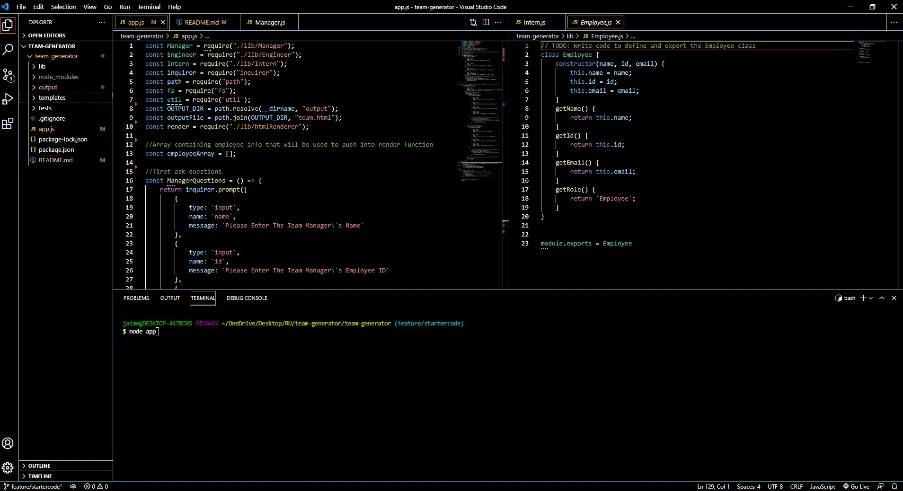
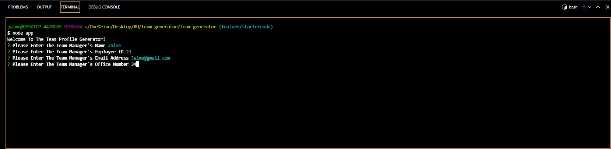
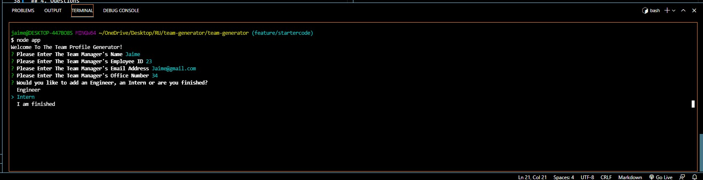
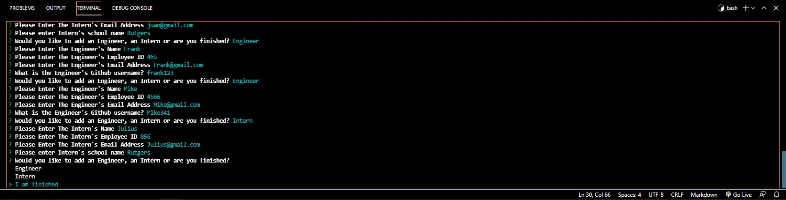
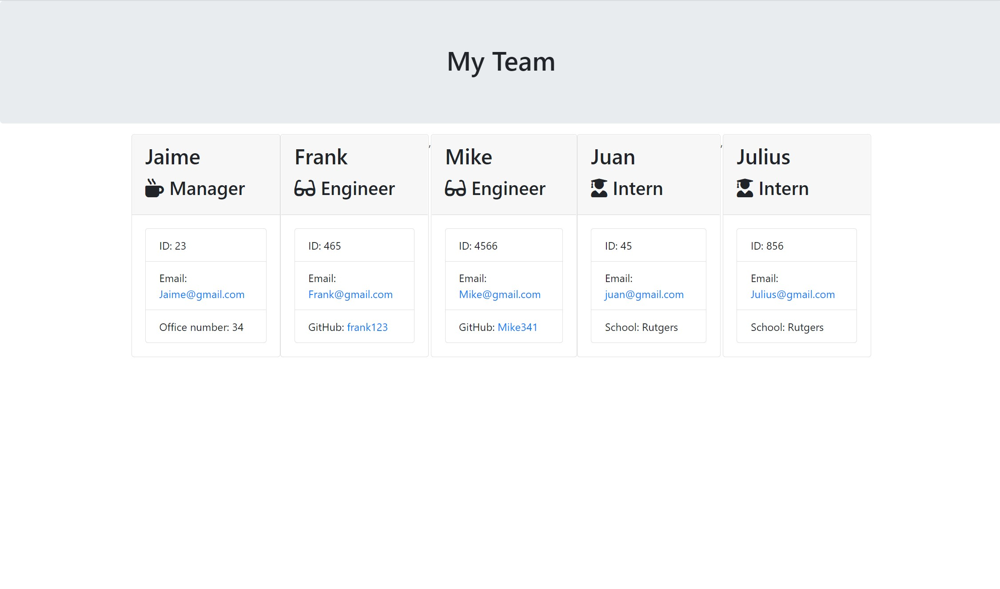

# README GENERATOR:

1. [ Description. ](#desc)
2. [ Web Address. ](#web-address)
3. [ Usage tips. ](#usage)
4. [ Questions. ](#questions)

## 1. DESCRIPTION

A Node.js command-line application that takes in information about employees on a software engineering team and generates an HTML webpage that displays summaries for each person.
This is a command line application that runs on Node.js and uses Javascript, Inquirer and fs.

## 2. How to Get There

Open your favorite web browser and enter the following web address to access.

https://jaimevilches87.github.io/team-generator/

## 3. Usage Tips

Start by running node on command line

Answer questions to input Manager's info

Choose if you would you like to add an Engineer, an Intern or are finished?

Answer more questions to input Engineer's and Intern's info

Sample HTML file that is generated

Testing the application  

## 4. Questions

Any questions feel free to reach out to me!

Email: JaimeVilches87@gmail.com